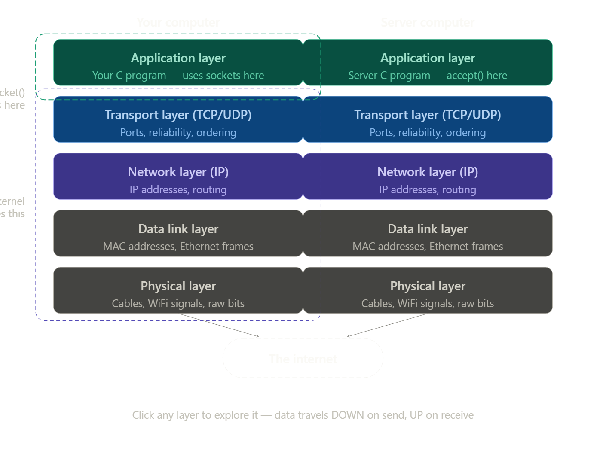
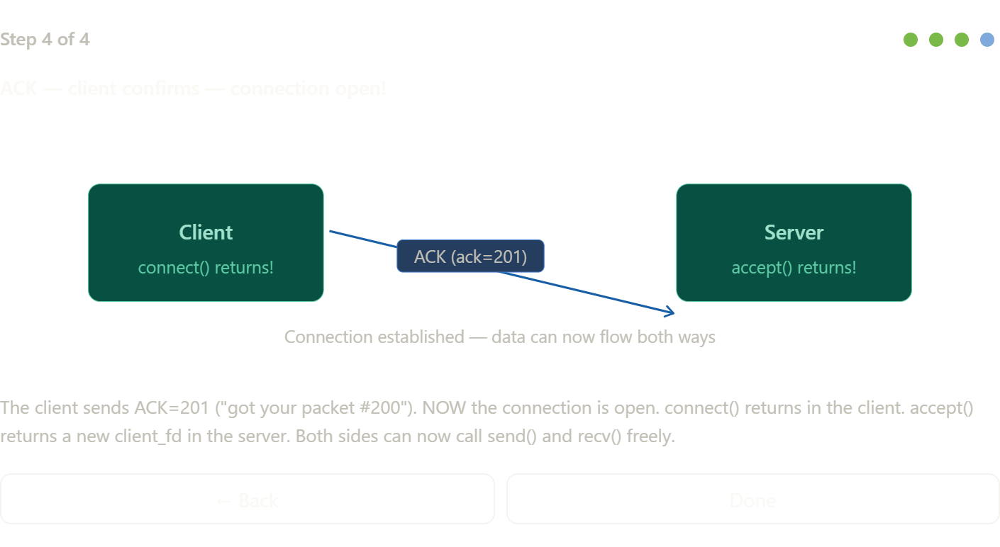
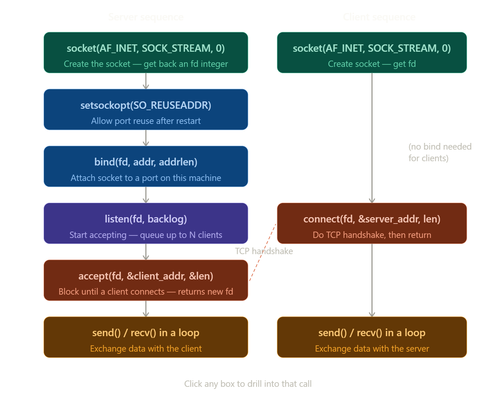

# 🚀 Robust TCP Chat Server

A high-performance, multi-threaded networking implementation built with Python. This project is engineered for **fault-tolerance**, **thread safety**, and **clean resource management**.

---

## 📖 The Technical Logic

### 1. Sockets & The OSI Model
A **Socket** is the combination of an **IP Address** and a **Port** (e.g., `127.0.0.1:9999`). 
If you wonder what is really a **socket** is just a combination of ip and port like 192.0.2.1:8080.
Sockets live at the very top of this stack — they're the doorway your application code uses to hand data off to the OS, which handles all the layers below.
In this project, we write code at the **Application Layer**. As messages are sent, they travel down the OSI stack, through the Transport and Network layers handled by the Operating System, and across the wire as raw bits.



---

### 2. How TCP Works (The 3-Way Handshake)
This server uses `SOCK_STREAM` (TCP), which ensures no data is lost during transit. Before chatting, the Client and Server perform a **3-Way Handshake**:

1. **SYN:** Client knocks with a sequence number (e.g., #100).
2. **SYN-ACK:** Server acknowledges (#101) and sends its own sync (#200).
3. **ACK:** Client confirms receipt (#201).

Only after this sequence is the connection "Established."



---

### 3. Server Sequence & File Descriptors
The server follows a specific system-level sequence to stay responsive:

1. **Initialize:** `socket()` creates the endpoint.
2. **Bind:** `bind()` attaches the server to a specific port.
3. **Listen:** `listen()` puts the server in a waiting state.
4. **Accept:** `accept()` blocks until a client connects, then returns a **File Descriptor (fd)**.

**What is an fd?** It is an integer the OS uses to identify the "pipe" between the server and a specific client. We store these fds in a list so the server knows exactly who to broadcast messages to.



---

### 4. Multi-threading: The Restaurant Metaphor
To handle many people at once without freezing, this project uses **Daemon Threads**. 

Imagine a **Restaurant**:
* **The Manager (Main Thread):** Stands at the door. When a client arrives, the manager welcomes them and immediately passes the work to a **Waiter**.
* **The Waiters (Worker Threads):** Each waiter focuses on one client—asking for their name and handling their chat loop.
* **Background Workers:** Since these are **Daemon** threads, if the restaurant (the main program) closes, all the waiters stop working and the threads terminate automatically.

---

### 5. Why is it "Robust"?
Most basic chat servers crash when a user abruptly closes their window. This project solves that by:
* **Handling WinError 10054:** Specific exception handling for `ConnectionResetError` prevents infinite error loops.
* **Thread Safety:** Uses `threading.Lock()` to ensure that when one thread adds or removes a client from the list, it doesn't corrupt the data for others.
* **Graceful Exit:** A `finally` block guarantees that even if a crash occurs, the socket is closed and the "Ghost Client" is removed from the registry.

---

## 🛠️ Installation & Usage

1. **Clone the Repo:**
   ```bash
   git clone [https://github.com/Suriyaa-P/robust_tcp_chat_server.git](https://github.com/Suriyaa-P/robust_tcp_chat_server.git)

2. ``` python chat_server.py```

3. ### **Terminal 1:**
``` python chat_client.py``

### **Terminal 2:**
``` python chat_client.py``

### **Terminal 3:**
``` python chat_client.py``